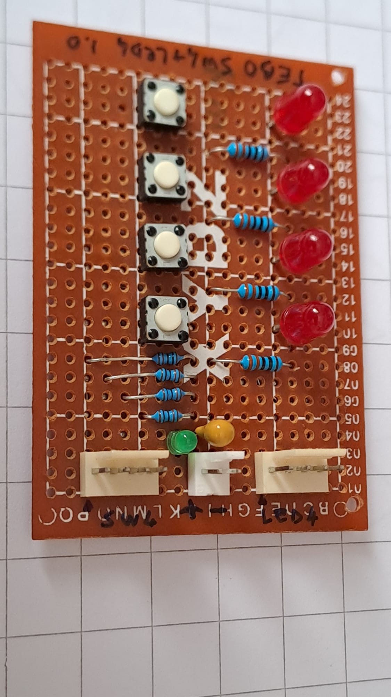

# *Switch & LED Array (4x4)* Module Board
**Module Board Status**: `[Validated]`

Four channel active-low switch input array and four channel active-high LED output array module board.  
This MOB operates across a logic supply voltage range from $3.3\text{V}$ to $5.0\text{V}$.

This input/output module combines four user-input active-low SPST tactile switches with pull-up resistors and four dedicated active-high LED indicators with integrated current limiters on a single board.

## Specifications
| Parameter | Min | Typical | Max | Unit | Notes |
| :--- | :---: | :---: | :---: | :---: | :--- |
| **Supply Voltage** | 3.3 | 5.0 | 5.0 | V | Main power bus ($V_{CC}$) |
| **Bulk Capacitance** | — | 10 | — | $\mu$F | Tantalum capacitor ($C$) |
| **Quiescent Current ($I_Q$)** | 1.5 | 3.2 | 3.2 | mA | Idle state (all switches open, all output LEDs off) at $3.3\text{V} / 5.0\text{V}$ |
| **Input Switch Channels** | — | 4 | — | Lines | Active-low logic outputs (`J1` pins 1–4) |
| **Output LED Channels** | — | 4 | — | Lines | Active-high logic inputs (`J2` pins 1–4) |
| **Pull-up Resistance** | — | 10 | — | k$\Omega$ | Integrated per-channel pull-up ($R1$–$R4$) |
| **Switch Active Current** | 0.33 | 0.50 | 0.50 | mA | Per pressed switch ($I_{SW} = V_{CC} / 10\text{k}\Omega$) at $3.3\text{V} / 5.0\text{V}$ |
| **LED Channel Active Current** | 1.4 | 3.1 | 3.1 | mA | Per active HIGH line ($I_{CH} = (V_{IN} - V_F) / 1\text{k}\Omega$) at $3.3\text{V} / 5.0\text{V}$ |

## Design

### Schematic

### Circuit Description
The circuit combines a 4-bit digital input array and a 4-bit digital output indicator array. The input section interfaces tactile switches ($SW1$–$SW4$) using active-low logic routed to header `J1`, with integrated $10\text{k}\Omega$ pull-up resistors ($R1$–$R4$). The output section provides four 3mm green indicator LEDs ($DL1$–$DL4$) routed to header `J2`, driven active-high with $1\text{k}\Omega$ current limiting resistors ($R5$–$R8$). The board power bus provides local decoupling through a $10\,\mu\text{F}$ tantalum capacitor (`C`) and indicates power status via a green LED (`DL`) with a $1\text{k}\Omega$ series resistor (`R`).

### PCB Layout

## Test Log
The board was tested using a GVDA 30V/10A switching laboratory power supply and a GD128 digital multimeter.

**Quiescent Current Verification**:
| Supply Voltage | Expected Idle | Idle (Switches Open / LEDs Off) |
| :---: | :---: | :---: |
| **3.3V** | $1.50\text{mA}$ | $1.40\text{mA}$ |
| **5.0V** | $3.20\text{mA}$ | $3.09\text{mA}$ |

*\*Note: Expected idle values assume nominal LED $V_F = 1.8\text{V}$, while measured diode drop was $1.95\text{V}$.*

 

**Switch Channel Current Verification**:
| Supply Voltage | Single Switch Pressed | All 4 Switches Pressed |
| :---: | :---: | :---: |
| **3.3V** | $1.73\text{mA}$ | $2.72\text{mA}$ |
| **5.0V** | $3.59\text{mA}$ | $5.09\text{mA}$ |

 

**LED Channel Current Verification**:
| Input Signal Line ($V_{IN}$) | Single LED Active | All 4 LEDs Active |
| :---: | :---: | :---: |
| **3.3V** | $1.40\text{mA}$ | $5.60\text{mA}$ |
| **5.0V** | $3.09\text{mA}$ | $12.3\text{mA}$ |

*\*Note: Active LED channel current is sourced directly from the input signal lines (`J2`), not the main $V_{CC}$ power header.*

## Bill of Materials
- [x] 1 x Prototyping paperboard 5x7cm
- [x] 1 x 2-pin power connector (Molex-KK)
- [x] 2 x 4-pin data connectors (Molex-KK, `J1` Switches, `J2` LEDs)
- [x] 1 x Tantalum bulk capacitor $10\,\mu\text{F}$ / 16V ($C$)
- [x] 1 x Power LED limiting resistor $1\text{k}\Omega$ (`R`)
- [x] 1 x Power indicator green LED 3mm (`DL`)
- [x] 4 x Pull-up resistors $10\text{k}\Omega$ ($R1$–$R4$)
- [x] 4 x SPST NO tactile pushbuttons ($SW1$–$SW4$)
- [x] 4 x Output LED current limiters $1\text{k}\Omega$ ($R5$–$R8$)
- [x] 4 x Data activity green LEDs 3mm ($DL1$–$DL4$)