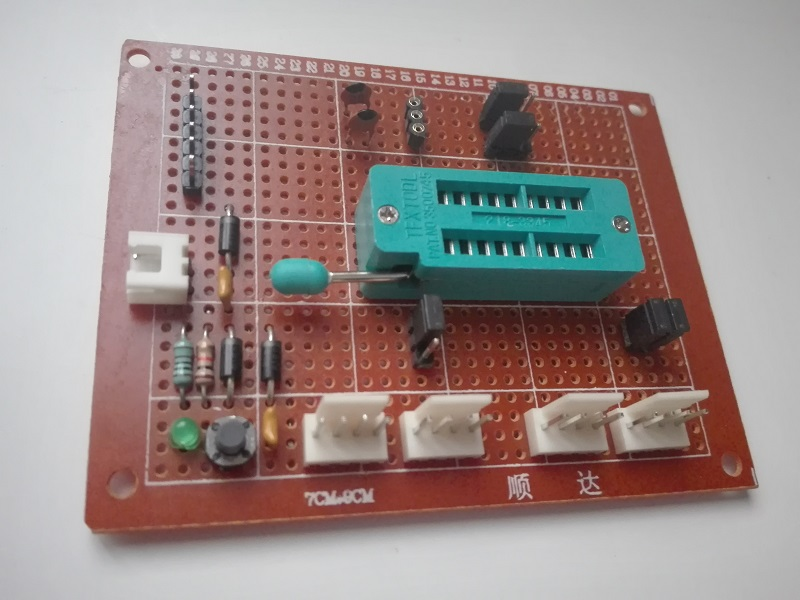
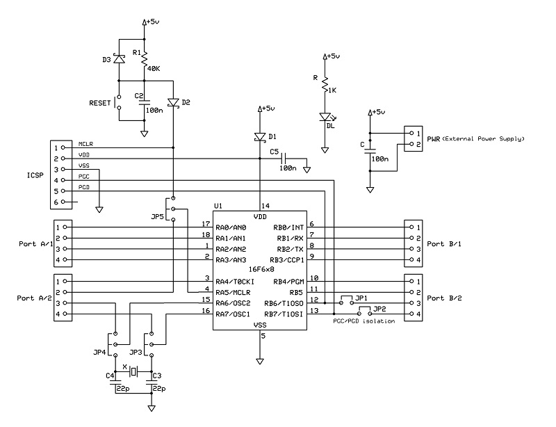
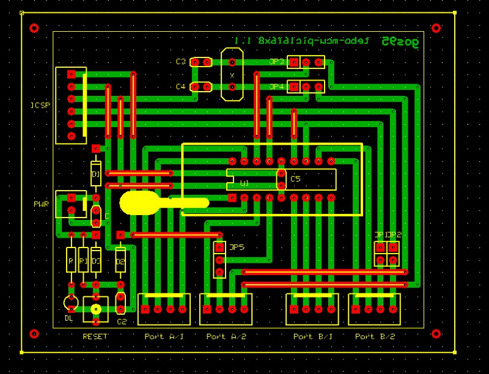

# *MCU PIC16F6x8* Module Board
**Module Board Status**: `[Prototyped]`

Microchip PIC16F628 / PIC16F648 microcontroller core breakout module board.  
This MOB operates at a nominal logic supply voltage of $5.0\text{V}$.

This module serves as a modular hardware core for 18-pin PIC microcontrollers. It integrates dedicated In-Circuit Serial Programming (ICSP) isolation, hardware debounced reset circuitry, an optional external crystal oscillator network, and full I/O port breakout headers.

## Specifications
| Parameter | Min | Typical | Max | Unit | Notes |
| :--- | :---: | :---: | :---: | :---: | :--- |
| **Supply Voltage** | 4.5 | 5.0 | 5.5 | V | Main external power bus ($V_{CC}$) |
| **Bulk Capacitance** | — | 10 | — | $\mu$F | Tantalum capacitor ($C$) |
| **Quiescent Current** | — | 4.5 | — | mA | Base idle current at $5.0\text{V}$ (MCU active, no external I/O load) |
| **Oscillator Frequency** | — | 4.0 | 20.0 | MHz | External crystal option (or $4\text{MHz}$ internal RC oscillator) |
| **I/O Breakout** | — | 16 | — | Pins | Complete Port A (8 lines) and Port B (8 lines) accessibility |

## Design

### Schematic

### Circuit Description
The board architecture forms a flexible hardware development system for Microchip 18-pin microcontrollers ($U1$). Power processing includes an inline reverse-current protection diode ($D1$), a $10\,\mu\text{F}$ tantalum reservoir, and dual $100\text{nF}$ high-frequency decoupling capacitors ($C$, $C5$). 

The reset subsystem controls the `RA5/MCLR` pin through an $R1/C2$ ($40\text{k}\Omega / 100\text{nF}$) network with a tactile `RESET` button. Diodes $D2$ and $D3$ safe-keep the logic rails from the high-voltage ($13\text{V}$) entry during programming routines. 

Jumper routing options maximize hardware layout freedom:
* **`JP1` and `JP2`**: Isolate ICSP lines `PGC` and `PGD` from `Port B/2` to eliminate physical pin contention during flash updates.
* **`JP3` and `JP4`**: Toggle between an external crystal resonator `X` (with $22\text{pF}$ load capacitors $C3, C4$) and alternative digital general-purpose I/O on `RA6` and `RA7`.
* **`JP5`**: Disconnects the multi-function `MCLR` structure from the standard external distribution headers.

### PCB Layout

## Bill of Materials
- [x] 1 x Prototyping paperboard 5x7cm
- [x] 1 x 2-pin power connector (Molex-KK, `PWR`)
- [x] 1 x 6-pin ICSP header connector
- [x] 4 x 4-pin data/port connectors (Molex-KK, `Port A/1`, `Port A/2`, `Port B/1`, `Port B/2`)
- [x] 5 x 2-pin male headers with shorting shunts (`JP1`–`JP5`)
- [x] 1 x Tantalum bulk capacitor $10\,\mu\text{F}$ / 16V ($C$)
- [x] 2 x Ceramic decoupling capacitors $100\text{nF}$ ($C$, $C5$)
- [x] 2 x Ceramic crystal load capacitors $22\text{pF}$ ($C3, C4$)
- [x] 1 x HC-49/S low-profile crystal oscillator (e.g., 4MHz / 20MHz, `X`)
- [x] 1 x Power LED limiting resistor $1\text{ k}\Omega$ (`R`)
- [x] 1 x Power indicator green LED 3mm (`DL`)
- [x] 1 x Master Reset pull-up resistor $40\text{ k}\Omega$ ($R1$)
- [x] 3 x Fast-switching signal diodes (1N4148, $D1$–$D3$)
- [x] 1 x Tactile pushbutton switch (`RESET`)
- [x] 1 x 18-pin DIP ZIF socket (or machined IC socket for $U1$)