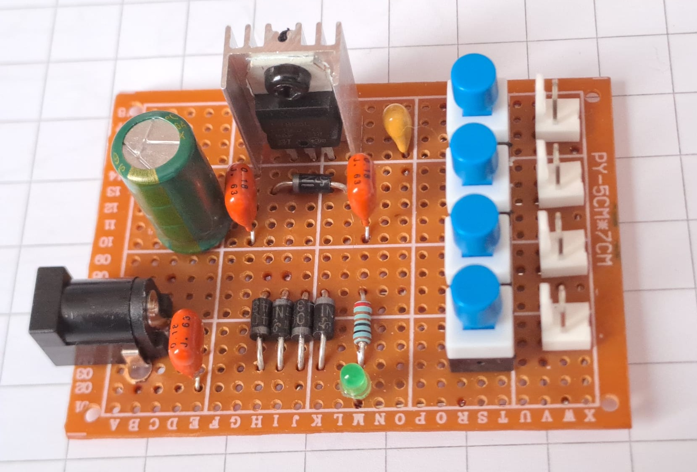
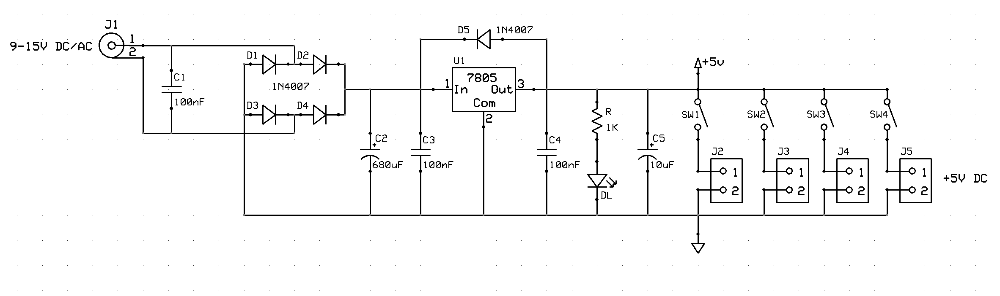
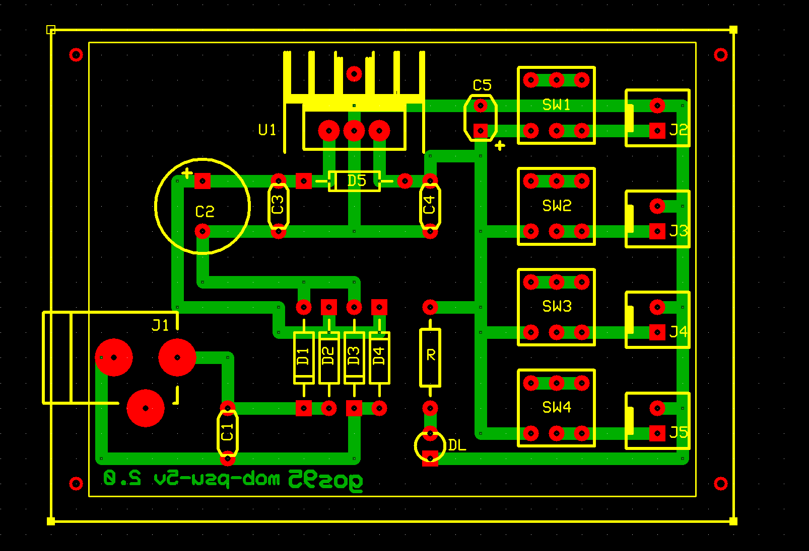

# *PSU 5V (4-Way Distribution)* Module Board
**Module Board Status**: `[Validated]`

Single-rail linear power supply and 4-channel distribution module board delivering a stabilized $+5\text{V}$ output.  
This MOB accepts wide-range AC or DC input voltages from $9\text{V}$ to $15\text{V}$.

This module serves as a central power distribution hub for operational systems running at $5\text{V}$ logic voltages. It features full AC/DC rectification, regulator reverse-current protection, and four independently switched output channels to isolate individual downstream hardware loads.

## Specifications
| Parameter | Min | Typical | Max | Unit | Notes |
| :--- | :---: | :---: | :---: | :---: | :--- |
| **Supply Voltage** | 9.0 | 9.0 - 12.0 | 15.0 | V | AC RMS or DC input range |
| **Output Voltage**| 4.80 | 5.0 | 5.20 | V | Regulated $+5\text{V}$ bus rail |
| **Maximum Output Total Current** | — | — | 350 @ 12.0VDC, 500 @ 9.0VDC | mA | Thermally limited by TO-220 heatsink ($\Theta_{hs} \approx 30\text{ K/W}$, $T_{J_{MAX}} \le 100 \text{ }^\circ C$) |
| **Main Smoothing Filter** | — | 680 | — | $\mu$F | Electrolytic smoothing capacitor ($C2$) |
| **Bulk Output Capacitance** | — | 10 | — | $\mu$F | Tantalum stabilization capacitor ($C5$) |
| **Distribution Ports** | — | 4 | — | Ways | Independently switched 2-pin outputs |

## Design

### Schematic

### Circuit Description
The power input configuration centers around the barrel jack `J1` ($5.1\text{mm}$). A front-end $100\text{nF}$ ceramic capacitor (`C1`) shunts high-frequency line noise before processing. Rectification and universal polarity safety are handled by a full-bridge network utilizing four 1N4007 power diodes (`D1`–`D4`). The rectified waveform is filtered via a $680\,\mu\text{F}$ electrolytic reservoir capacitor (`C2`) working alongside a localized $100\text{nF}$ decoupling capacitor (`C3`).

Voltage transformation is managed by a standard 7805 linear regulator (`U1`) in a TO-220 package equipped with a small aluminum heatsink to handle thermal dissipation. 
Protection and stability structures include:
* **`D5` (Reverse Protection Diode)**: Placed in antiparallel across `U1` (pins 3 to 1) to shunt discharge currents from downstream capacitors during power-down, preventing catastrophic internal regulator bias failures.
* **Output Stabilization**: A high-frequency $100\text{nF}$ ceramic capacitor (`C4`) paired with a high-grade $10\,\mu\text{F}$ tantalum bulk capacitor (`C5`) ensures low ESR response and eliminates output ringing. A green LED (`DL`) monitored by an $1\text{ k}\Omega$ series resistor (`R`) displays the primary rail status.

The downstream network splits the $+5\text{V}$ rail into four parallel distribution channels (`J2` to `J5`). Each channel is wired through an individual SPST toggle switch (`SW1`–`SW4`), allowing isolated control of target peripheral sub-modules.

### PCB Layout

## Test Log
**Thermal & Load Test (12.0V DC Input)**:
* Load on Single Channel: 18.8Ω (4×4.7Ω 10W resistors in series)
* $I_{\text{OUT}}$: $266\text{ mA}$.
* $T_{\text{amb}}$: $30^\circ\text{C}$.
* Measured Heatsink Temp ($T_{hs}$): $74^\circ\text{C}$ after 10 min continuous load.
* Calculated Junction Temp ($T_J$): $\approx 82^\circ\text{C}$.
* $V_{\text{OUT}}$ Stability: $5.01\text{V}$ (cold) $\to 5.03\text{V}$ (hot, $+0.4\%$ thermal drift) $\to 5.01\text{V}$ (cooled down).

## Bill of Materials
- [x] 1 x Prototyping paperboard 5x7cm
- [x] 1 x DC Power Jack barrel connector PCB mount ($5.1\text{mm}$, `J1`)
- [x] 4 x 2-pin power distribution headers (Molex-KK, `J2`, `J3`, `J4`, `J5`)
- [x] 4 x SPST or SPDT miniature toggle/slide switches (`SW1`, `SW2`, `SW3`, `SW4`)
- [x] 1 x Positive Linear Regulator $5\text{V}$ / 1A (TO-220, 7805, `U1`)
- [x] 1 x Clip-on or bolt-on small heatsink designed for TO-220 packages
- [x] 5 x General-purpose rectifying power diodes 1A / 1000V (1N4007, `D1`–`D5`)
- [x] 1 x Aluminum electrolytic capacitor $680\,\mu\text{F}$ / 25V or higher (`C2`)
- [x] 1 x Tantalum bulk filter capacitor $10\,\mu\text{F}$ / 16V (`C5`)
- [x] 3 x Ceramic decoupling capacitors $100\text{nF}$ / 50V (`C1`, `C3`, `C4`)
- [x] 1 x Power activity indicator green LED 3mm (`DL`)
- [x] 1 x LED current limiter resistor $1\text{ k}\Omega$ (`R`)