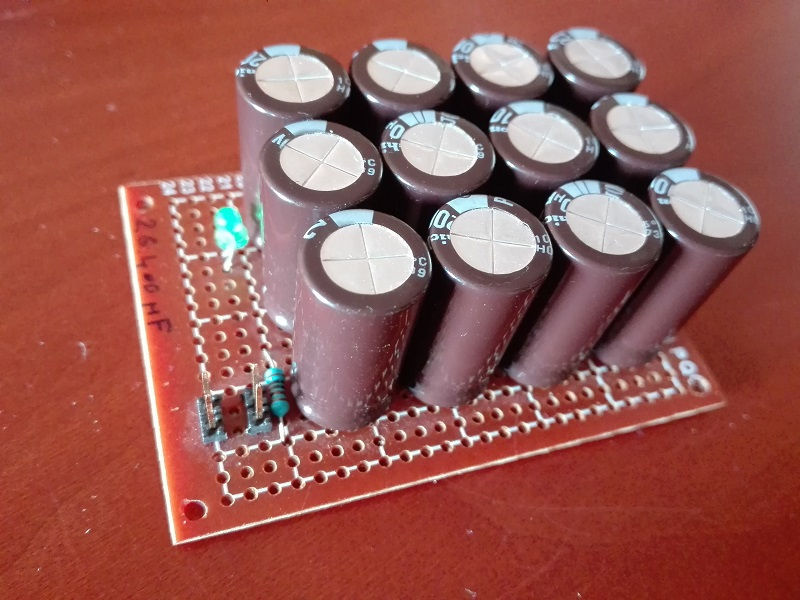
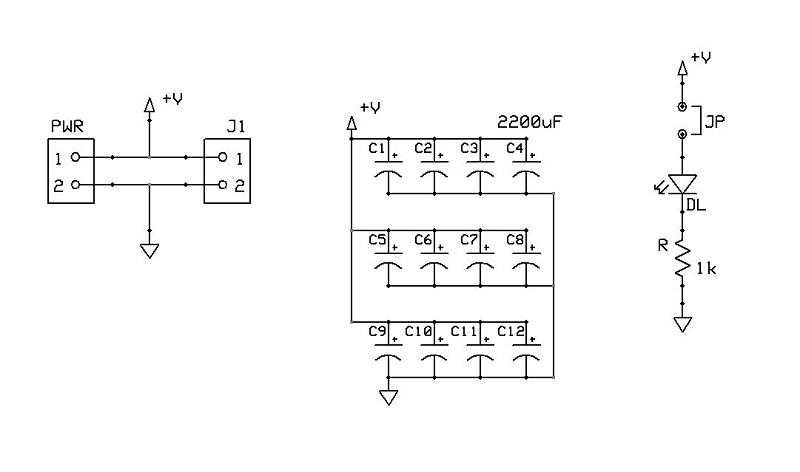
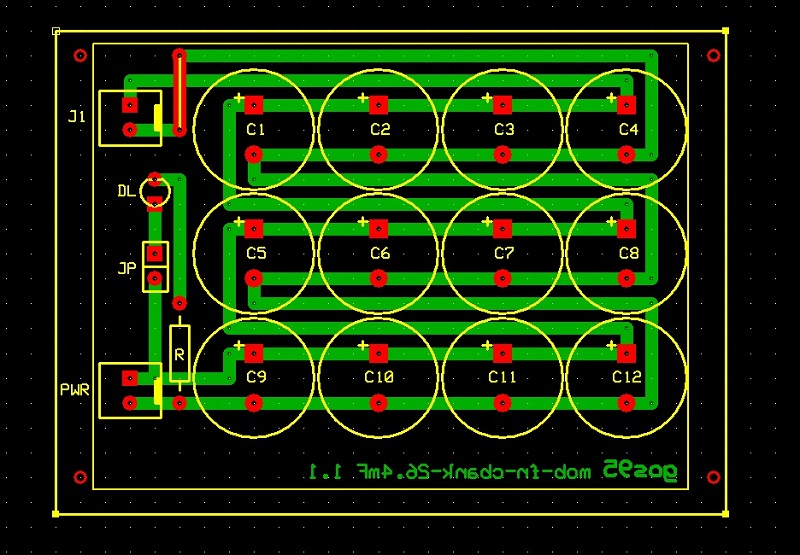

# *C-Bank 26.4mF* Module Board
**Module Board Status**: `[Prototyped]`

High-capacity $26400\,\mu\text{F}$ capacitor bank power filtering and stabilization module board.  
This MOB operates across a DC supply voltage range from $3.3\text{V}$ to $5.0\text{V}$.

This module provides massive localized energy storage and bulk decoupling for power supply rails.

## Specifications
| Parameter | Min | Typical | Max | Unit | Notes |
| :--- | :---: | :---: | :---: | :---: | :--- |
| **Operating Voltage** | 3.3 | 5.0 | 5.0 | V | DC power rail input/output ($V_{CC}$) |
| **Total Capacitance** | — | 26.4 | — | mF | $12 \times 2200\,\mu\text{F}$ nominal capacitance |
| **Quiescent Current ($I_Q$)** | 0.0 | 3.2 | 3.2 | mA | Idle leakage current (Depends entirely on `JP` status) |
| **Indicator Current** | 1.4 | 3.1 | 3.1 | mA | Sourced through `JP` when populated at $3.3\text{V} / 5.0\text{V}$ |
| **Connectors** | — | 2 | — | Ports | Dual parallel 2-pin headers (`PWR` and `J1`) |

## Design

### Schematic

### Circuit Description
The circuit acts as a heavy-duty power rail stabilizer. Twelve $2200\,\mu\text{F}$ electrolytic capacitors ($C1$–$C12$) are arranged in parallel to yield a total nominal capacitance of $26400\,\mu\text{F}$ ($26.4\text{mF}$), drastically reducing low-frequency ripple and countering sudden voltage sags under heavy dynamic loads. Two 2-pin Molex-KK connectors (`PWR` and `J1`) are hardwired in parallel to allow inline loop-through routing. Visual voltage status is provided by a green 3mm LED (`DL`) with a $1\text{k}\Omega$ current limiter (`R`), which can be physically isolated from the rail via a 2-pin jumper header (`JP`) to eliminate parasitic current draw.

### PCB Layout

## Bill of Materials
- [x] 1 x Prototyping paperboard 5x7cm
- [x] 2 x 2-pin power connectors (Molex-KK, `PWR` Input, `J1` Aux/Output)
- [x] 12 x Aluminum electrolytic capacitors $2200\,\mu\text{F}$ (e.g., 6.3V/10V or higher, $C1$–$C12$)
- [x] 1 x 2-pin male pin-header for option jumper (`JP`)
- [x] 1 x Shunt jumper block
- [x] 1 x Power status indicator green LED 3mm (`DL`)
- [x] 1 x Power LED limiting resistor $1\text{k}\Omega$ (`R`)