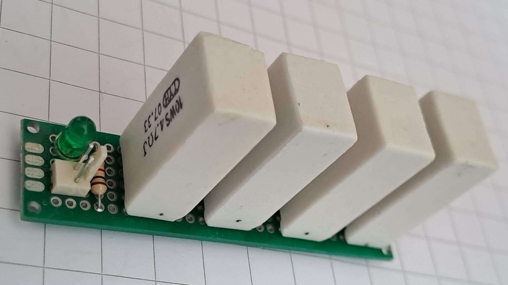
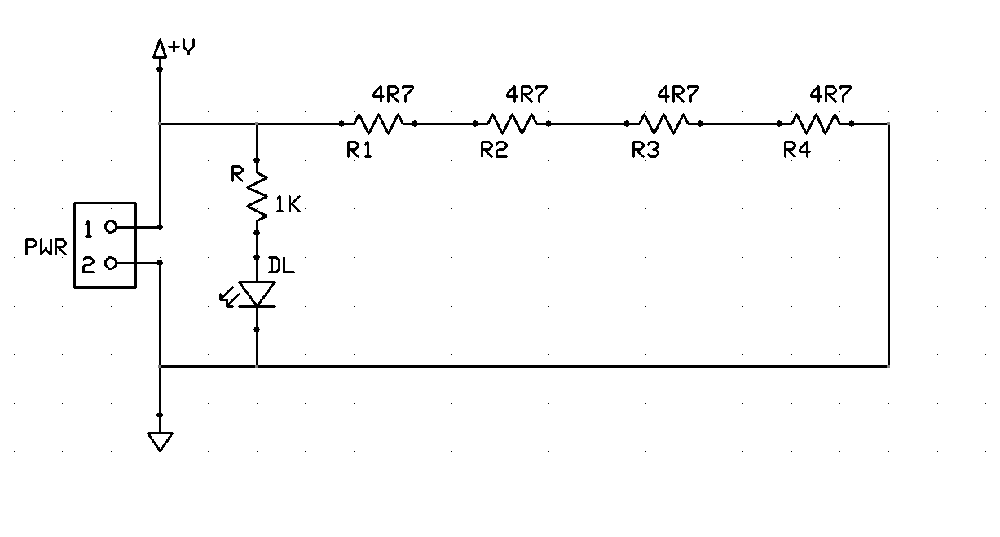
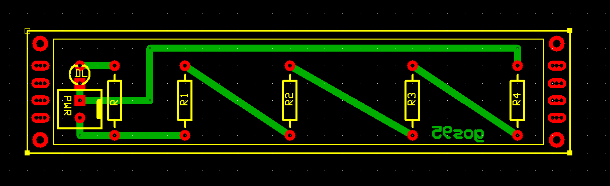

# *Resistive Load 18.8 ohm Module Board
**Module Board Status**: `[Validated]`

Resistive dummy load for bench small PSU testing.  
This MOB operates across a supply voltage range from $3.3\text{V}$ to $9.0\text{V}$.

This MOB provides a fixed resistive load specifically designed to draw standard baseline test currents across the typical power supply rails used in the library:

* **$\approx 150\text{ mA}$ @ 3.3V** (Logic & Low-Power Rails)
* **$\approx 250\text{ mA}$ @ 5.0V** (Standard Logic & Microcontroller Rails)
* **$\approx 500\text{ mA}$ @ 9.0V** (Analog & Audio Stage Rails)

Built using four oversized ceramic power resistors in series, it provides a safe load to verify power supply regulation, voltage drop, and thermal behavior under realistic operating stress.

## Specifications
| Parameter | Min | Typical | Max | Unit | Notes |
| :--- | :---: | :---: | :---: | :---: | :--- |
| **Operating Voltage ($V_{CC}$)** | 3.3 | 5.0 | 9.0 | V | DC power rail under test (`PWR`) |
| **Equivalent Load Resistance** | — | 18.8 | — | $\Omega$ | $4 \times 4.7\,\Omega$ series array |
| **Current Draw @ 3.3V** | — | 175 | — | mA | $P_{\text{tot}} \approx 0.58\text{ W}$ |
| **Current Draw @ 5.0V** | — | 266 | — | mA | $P_{\text{tot}} \approx 1.33\text{ W}$ |
| **Current Draw @ 9.0V** | — | 479 | — | mA | $P_{\text{tot}} \approx 4.31\text{ W}$ |

## Design

### Schematic

### Circuit Description
The circuit consists of four $4.7\,\Omega$ / $10\text{W}$ ceramic power resistors ($R1$–$R4$) wired in a series topology. A green status LED (`DL`) monitors voltage presence across the load terminals.

### PCB Layout

## Test Log
The board was tested using a GVDA 30V/10A switching laboratory power supply and a GD128 digital multimeter.

**DC Current Draw and Thermal Verification ($T_{amb} = 30^\circ\text{C}$)**:
| Voltage Input | Measured Current (*) | Measured Power (*) | Resistors Temperature (10 min run) |
| :---: | :---: | :---: | :---: |
| **$3.30\text{ V}$** | $175\text{ mA}$ | $0.58\text{ W}$ | $33^\circ\text{C}$ |
| **$5.00\text{ V}$** | $266\text{ mA}$ | $1.33\text{ W}$ | $38^\circ\text{C}$ | 
| **$9.00\text{ V}$** | $480\text{ mA}$ | $4.32\text{ W}$ | $58^\circ\text{C}$ |

\**Note: The measured current and power represent the total board current and power consumption, including both the main power dummy load array ($R1$–$R4$) and the LED indicator branch.*

## Bill of Materials
- [x] 1 x Prototyping paperboard $2\times8\text{cm}$
- [x] 1 x 2-pin power input connector (Molex-KK, `PWR`)
- [x] 4 x Ceramic power resistors $4.7\,\Omega$ / 10W (`R1`–`R4`)
- [x] 1 x Carbon film resistor $1\text{ k}\Omega$ / 0.25W ($R_{\text{LED}}$)
- [x] 1 x Power activity indicator green LED 3mm (`DL`)