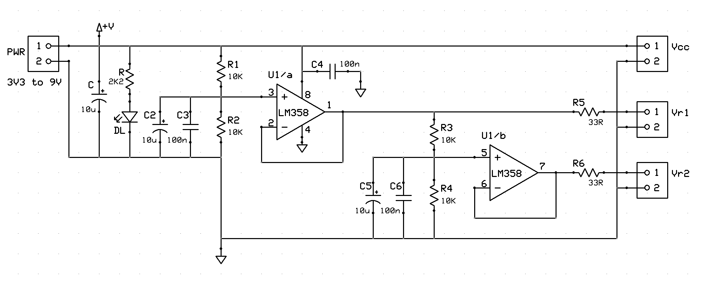
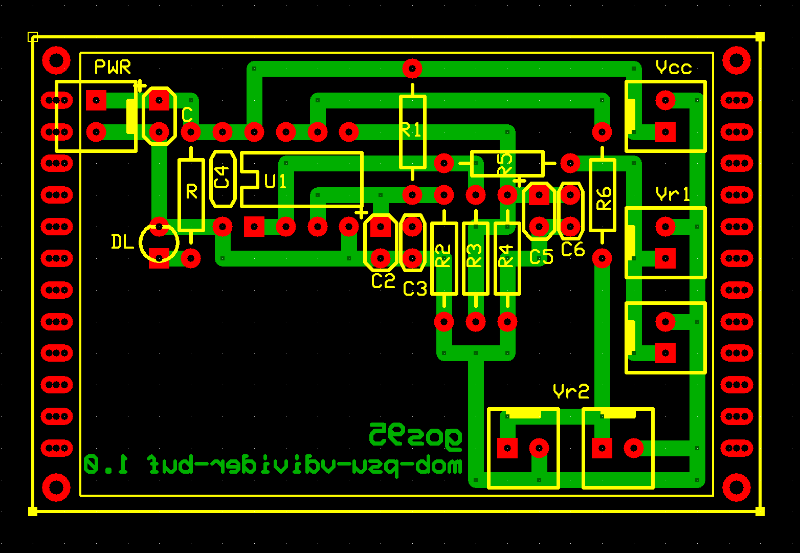

# *Dual Buffered Voltage Divider* Module Board
**Module Board Status**: `[Validated]`

A dual buffered voltage divider providing Vcc/2 and Vcc/4 reference outputs from a single Vcc supply.  
This MOB operates across a supply voltage range from $3.3\text{V}$ to $9.0\text{V}$.

This module was developed as a reusable reference-voltage for circuits requiring low-impedance fractions of the supply voltage. The buffered topology avoids the load-dependent voltage shift of a passive divider.

## Specifications
| Parameter | Min | Typical | Max | Unit | Notes |
| :--- | :---: | :---: | :---: | :---: | :--- |
| **Supply Voltage** | 3.3 | 5 - 9 | 9 | V | Main power bus ($V_{CC}$) |
| **Bulk Capacitance** | — | 10 | — | $\mu$F | Tantalum capacitor ($C$) |
| **Quiescent Current** | 1.7 | 2.7 | 4.9 | mA |  At $V_{CC} = 3.3\text{V}$ / $5.0\text{V}$ / $9.0\text{V}$ ($V_F = 1.8\text{V}$ LED) |
| **Maximum Design Output Current per channel** | — | — | 20 | mA |

## Design

### Schematic

### Circuit Description
The circuit generates two stable reference voltages proportional to the input $V_{CC}$ ($V_{CC}/2$ and $V_{CC}/4$).  
To prevent the load drawn from the outputs from altering the voltage division ratio, the resistor dividers are followed by a buffer stage configured as a unity-gain **Voltage Follower** ($A_V = 1$).
The 33 Ω series resistors at the outputs provides basic current limiting and isolation from external loads.

### PCB Layout

### Test Log
The board was tested using a GVDA 30V/10A switching laboratory power supply and a GD128 digital multimeter.

**Quiescent Current**: 
| Supply Voltage | Expected | Measured |
| :---: | :---: | :---: |
| **3.3V** | $1.7\text{mA}$ | $\text{mA}$ |
| **5.0V** | $2.7\text{mA}$ | $\text{mA}$ |
| **9.0V** | $4.9\text{mA}$ | $\text{mA}$ |

*\*Note: Expected values assume a nominal LED forward voltage $V_F = 1.8\text{V}$, while the actual measured diode drop was $1.9\text{V}$. This difference in $V_F$, together with component tolerances and measurement conditions, accounts for the observed discrepancy.*

 

**No-Load Voltage Verification**
| Supply Voltage ($V_{CC}$) | $V_{R1}$ Expected ($V_{CC}/2$) | $V_{R1}$ Measured | $V_{R2}$ Expected ($V_{CC}/4$) | $V_{R2}$ Measured |
| :---: | :---: | :---: | :---: | :---: |
| 3.3V | 1.65V | ** **  | 0.825V | ** **  |
| 5.0V | 2.50V | ** **  | 1.25V | ** **  |
| 9.0V | 4.50V | ** **  | 2.25V | ** ** |

 

**Output Voltage Stability**
| Test Condition | Expected Output | Measured | Deviation |
| :--- | :---: | :--- | :--- |
| $V_{CC} = 3\text{V}3$, $R_{load} = 165\,\Omega$ on $V_{R1}$ ($I_{out} = 20\text{mA}$) | **1.65V** | **** | $\%$ |
| $V_{CC} = 3\text{V}3$, $R_{load} = 82\,\Omega$ on $V_{R2}$ ($I_{out} = 20\text{mA}$) | **0.82V** | **** | $\%$ |
| $V_{CC} = 5\text{V}$, $R_{load} = 250\,\Omega$ on $V_{R1}$ ($I_{out} = 20\text{mA}$) | **2.50V** | **** | $\%$ |
| $V_{CC} = 5\text{V}$, $R_{load} = 125\,\Omega$ on $V_{R2}$ ($I_{out} = 20\text{mA}$) | **1.25V** | **** | $\%$ |
| $V_{CC} = 9\text{V}$, $R_{load} = 450\,\Omega$ on $V_{R1}$ ($I_{out} = 20\text{mA}$) | **4.50V** | **** | $\%$ |
| $V_{CC} = 9\text{V}$, $R_{load} = 225\,\Omega$ on $V_{R2}$ ($I_{out} = 20\text{mA}$) | **2.25V** | **** | $\%$ |

## Bill of Materials
- [x] Paperboard 4x6cm
- [x] 1 x Dual Op-Amp (e.g., LM358)
- [x] 4 x 2-pin Molex-KK header
- [x] 3 x Bulk capacitor (tantalum) 10uF 16V
- [x] 3 x Ceramic capacitor 100nF
- [x] 1 x LED current limiter resistor $2k2\Omega$
- [x] 1 x Power activity LED green 3mm
- [x] 4 x 1/4W 1% Resistors 10k ohm
- [x] 2 x 1/4W Resistors 33 ohm