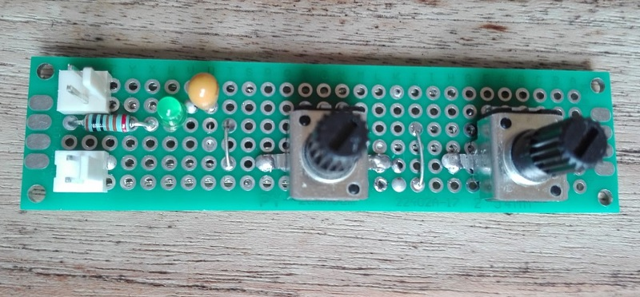
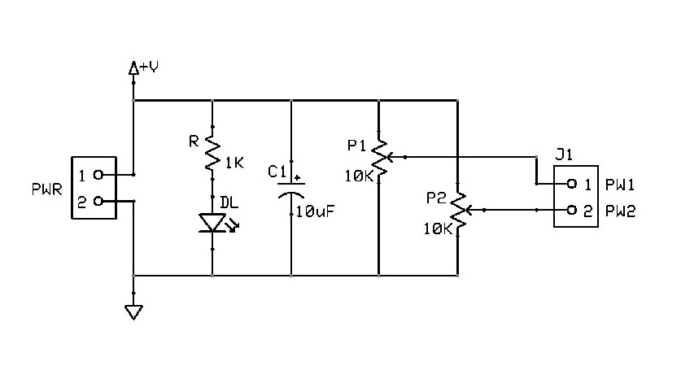
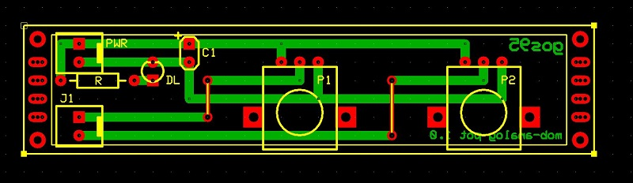

# *Voltage-Divider Potentiometer* Module Board
**Module Board Status**: `[Validated]`

Dual $10\text{k}\Omega$ potentiometers with outer terminals connected between power supply and ground, and wipers to the outputs.  
This MOB operates across a supply voltage range from $3.3\text{V}$ to $9.0\text{V}$.

This module was developed as a reusable dual-channel control interface to provide manually adjustable, passive reference voltages from a single power rail.

## Specifications
| Parameter | Min | Typical | Max | Unit | Notes |
| :--- | :---: | :---: | :---: | :---: | :--- |
| **Supply Voltage** | 3.3 | 5.0 | 9.0 | V | Main power bus ($V_{CC}$) |
| **Bulk Capacitance** | — | 10 | — | $\mu$F | Tantalum capacitor ($C$) |
| **Quiescent Current** | 2.2 | 4.3 | 9.0 | mA | At $V_{CC} = 3.3\text{V}$ / $5.0\text{V}$ / $9.0\text{V}$ (LED $V_F= 1.8\text{V}$) |
| **Potentiometer Track Resistance** | — | 10 | — | k$\Omega$ | Per channel, linear taper |
| **Equivalent Source Impedance** | 0 | — | 2.5 | k$\Omega$ | Max at 50% wiper position |
| **Minimum Recommended Load ($R_{load}$)** | 150 | — | — | k$\Omega$ | $\le 1.75\%$ loading error at 50% wiper |
| **Output Voltage Range** | 0.0 | — | $V_{CC}$ | V | Per channel ($PW1$, $PW2$) |

## Design

### Schematic

### Circuit Description
The circuit provides two independent, manually adjustable voltage outputs ($PW1$ and $PW2$) derived from the main supply bus ($V_{CC}$). It is designed for feeding high-impedance analog inputs, such as microcontroller ADCs, op-amp reference pins, or control voltage (CV) nodes.  
Since the outputs are unbuffered, the maximum equivalent source impedance ($R_{th}$) reaches $2.5\text{k}\Omega$ when a potentiometer is set to mid-scale ($50\%$). To limit loading-induced output error, the target load resistance should be kept high ($R_{load} \ge 150\text{k}\Omega$).

### PCB Layout

## Test Log
The board was tested using a GVDA 30V/10A switching laboratory power supply and a MITEK MK6322 digital multimeter.

**Quiescent Current**: 
| Supply Voltage | Expected | Measured |
| :---: | :---: | :---: |
| **3.3V** | $2.2\text{mA}$ | $2.0\text{mA}$ |
| **5.0V** | $4.3\text{mA}$ | $4.0\text{mA}$ |
| **9.0V** | $9.0\text{mA}$ | $8.7\text{mA}$ |

*\*Note: Expected values assume a nominal LED forward voltage $V_F = 1.8\text{V}$, while the actual measured diode drop was $2.0\text{V}$. This difference in $V_F$, together with component tolerances and measurement conditions, accounts for the observed discrepancy.*

 

**No-Load Voltage & Range Verification**:
| Supply Voltage | Channel | Expected Min (CCW) | Expected Max (CW) | Measured Min | Measured Max |
| :---: | :---: | :---: | :---: | :---: | :---: |
| **3.3V** | $PW1$ | $0.00\text{V}$ | $3.30\text{V}$ | $0.00\text{V}$ | $3.30\text{V}$ |
| **3.3V** | $PW2$ | $0.00\text{V}$ | $3.30\text{V}$ | $0.00\text{V}$ | $3.30\text{V}$ |
| **5.0V** | $PW1$ | $0.00\text{V}$ | $5.00\text{V}$ | $0.00\text{V}$ | $5.00\text{V}$ |
| **5.0V** | $PW2$ | $0.00\text{V}$ | $5.00\text{V}$ | $0.00\text{V}$ | $5.00\text{V}$ |
| **9.0V** | $PW1$ | $0.00\text{V}$ | $9.00\text{V}$ | $0.00\text{V}$ | $9.00\text{V}$ |
| **9.0V** | $PW2$ | $0.00\text{V}$ | $9.00\text{V}$ | $0.00\text{V}$ | $9.00\text{V}$ |

 

**Loading Effect & Source Impedance Verification *(at 50% wipers position and $R_{load} = 150\text{k}\Omega$)***

| Supply Voltage | Channel | Measured Unloaded | Expected Loaded ($V_{load}$) | Measured Loaded | Deviation |
| :---: | :---: | :---: | :---: | :---: | :---: |
| **3.3V** | $PW1$ | $1.65\text{V}$ | $1.62\text{V}$ | $1.63\text{V}$ | $+0.62\%$ |
| **3.3V** | $PW2$ | $1.65\text{V}$ | $1.62\text{V}$ | $1.63\text{V}$ | $+0.62\%$ |
| **5.0V** | $PW1$ | $2.50\text{V}$ | $2.46\text{V}$ | $2.47\text{V}$ | $+0.41\%$ |
| **5.0V** | $PW2$ | $2.50\text{V}$ | $2.46\text{V}$ | $2.47\text{V}$ | $+0.41\%$ |
| **9.0V** | $PW1$ | $4.50\text{V}$ | $4.43\text{V}$ | $4.43\text{V}$ | $+0.00\%$ |
| **9.0V** | $PW2$ | $4.50\text{V}$ | $4.43\text{V}$ | $4.43\text{V}$ | $+0.00\%$ |

*\*Note: Multimeter resolution is $10\text{mV}$.*

## Bill of Materials
- [x] 1 x Prototyping paperboard 2x8cm
- [x] 2 x 2-pin connectors (Molex-KK)
- [x] 1 x Tantalum bulk capacitor $10\,\mu\text{F}$ / 16V
- [x] 1 x Current limiting resistor $1\text{k}\Omega$ (for LED)
- [x] 1 x Green power activity LED (3mm)
- [x] 2 x $10\text{k}\Omega$ linear potentiometers